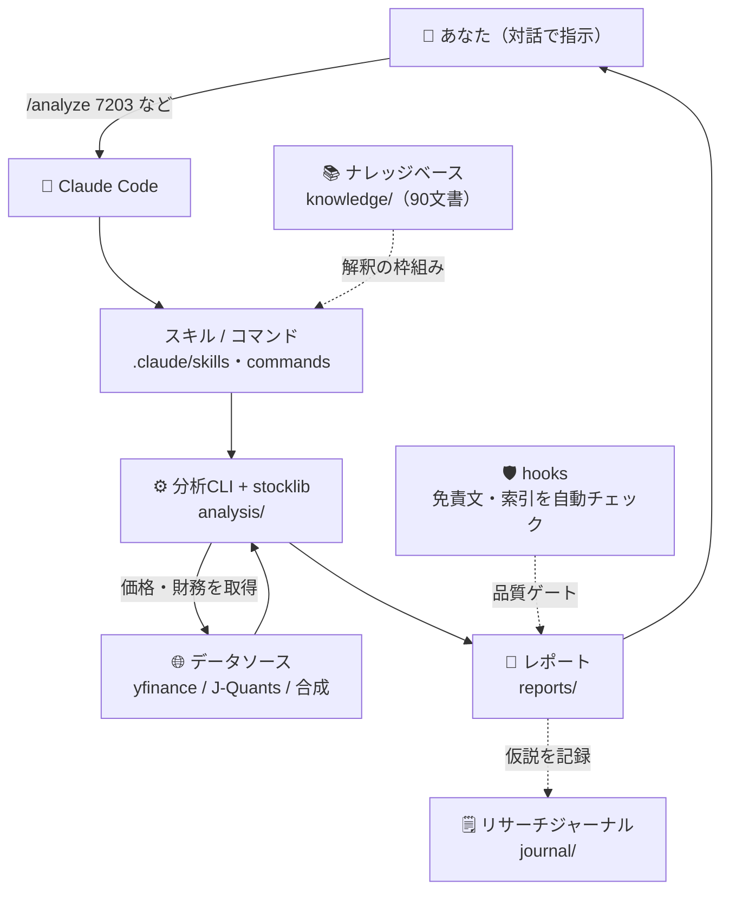
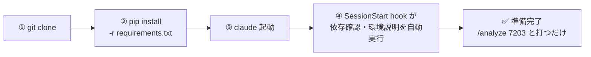
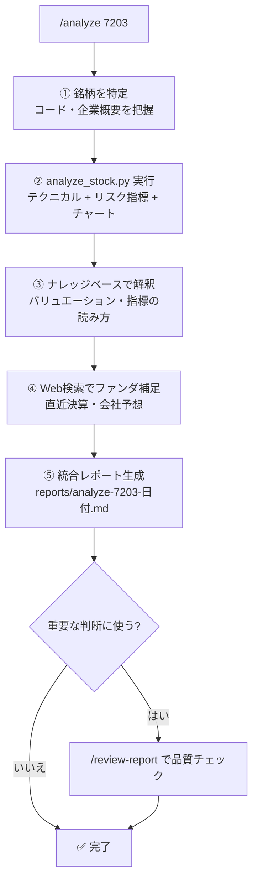
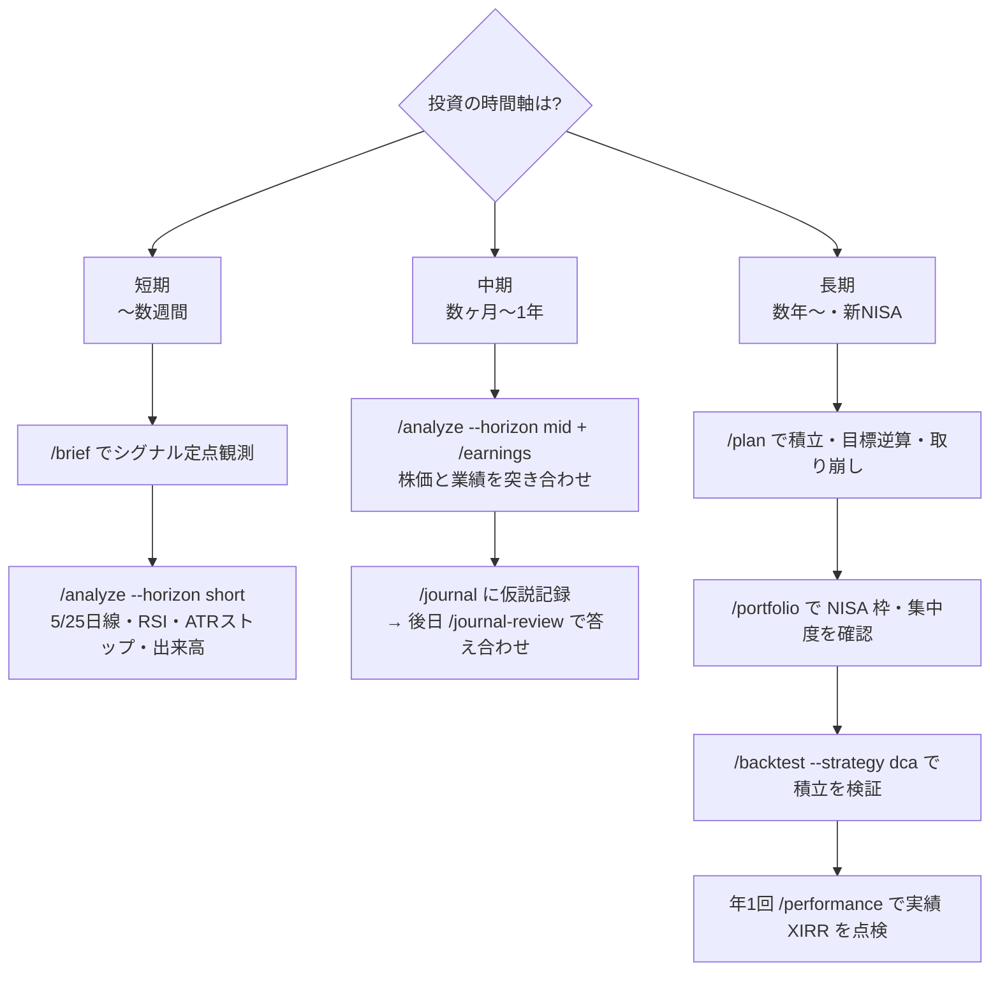
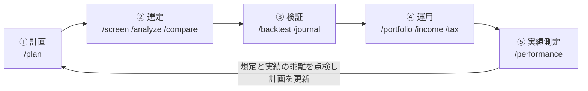
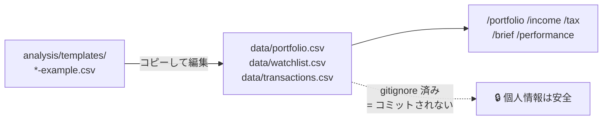
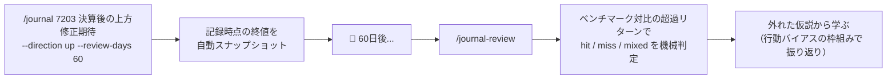
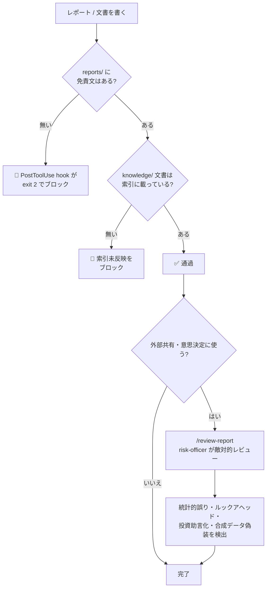

# stock_hacker

日本株（東証上場株式）の分析を一手に行うためのリポジトリ。
**Claude Code で開くだけで「日本株解析のプロフェッショナル」として振る舞う分析環境**になるよう、ナレッジベース・分析ライブラリ・CLI・スキル/エージェント/hooks を一体で整備している。

> ⚠️ **本リポジトリの出力はすべて「分析支援」であり「投資助言」ではありません。** 数値・枠組み・トレードオフといった判断材料を提供しますが、「買うべき/売るべき」は判断しません。投資判断はご自身の責任で行ってください。

---

## 目次

- [30秒で始める](#30秒で始める)
- [全体像 — 何と何がつながっているか](#全体像--何と何がつながっているか)
- [何ができるか（コマンド早見表）](#何ができるかコマンド早見表)
- [使い方ガイド（図解つき）](#使い方ガイド図解つき)
  - [1. セットアップ（初回だけ）](#1-セットアップ初回だけ)
  - [2. 基本の流れ：1銘柄を調べる](#2-基本の流れ1銘柄を調べる)
  - [3. 時間軸で使い分ける（短期・中期・長期）](#3-時間軸で使い分ける短期中期長期)
  - [4. 資産形成のライフサイクル](#4-資産形成のライフサイクル)
  - [5. 保有データを登録する（CSVの作り方）](#5-保有データを登録するcsvの作り方)
  - [6. 分析を「やりっぱなし」にしない（リサーチジャーナル）](#6-分析をやりっぱなしにしないリサーチジャーナル)
  - [7. 品質を守る仕組み（hooks / review-report）](#7-品質を守る仕組みhooks--review-report)
  - [8. よくある操作レシピ](#8-よくある操作レシピ)
  - [9. 困ったとき（FAQ・トラブルシュート）](#9-困ったときfaqトラブルシュート)
  - [10. 定期自動実行（cron / Routine）](#10-定期自動実行cron--routine)
- [出力イメージ](#出力イメージ)
- [データソースと制約（必読）](#データソースと制約必読)
- [J-Quants API キーの扱い（セキュリティ）](#j-quants-api-キーの扱いセキュリティ)
- [ディレクトリ構成](#ディレクトリ構成)
- [免責・ライセンス](#免責ライセンス)

---

## 30秒で始める

```bash
git clone <このリポジトリ> stock_hacker
cd stock_hacker
pip install -r requirements.txt   # pandas / numpy / yfinance / matplotlib / pytest
claude                            # Claude Code を起動
```

起動すると **SessionStart フックが依存確認と環境説明を自動で行う**。あとは対話で:

```
/analyze 7203
```

と打てば、トヨタ自動車（7203）のテクニカル・ファンダメンタル・リスクを統合した分析レポート（ローソク足チャート付き）が `reports/` に生成される。

> 💡 ネットワークが使えない環境でも、各 CLI に `--synthetic` を付ければ合成データ（シード固定）で全機能が動く（手法のデモ・検証用。**実データではない**）。

---

## 全体像 — 何と何がつながっているか

あなたが対話で指示すると、Claude Code が**スキル/コマンド**を起動し、その手順に従って**分析CLI**を実行する。CLI は**データソース**から価格・財務を取得し、**ナレッジベース**の知見を解釈の枠組みに使って、`reports/` に**レポート**を生成する。仮説は**ジャーナル**に記録し、**hooks** が免責・索引の品質を自動で守る。



| レイヤー | 役割 | 実体 |
|---|---|---|
| 対話 | あなたの意図を受け取る入口 | スラッシュコマンド17種（`/analyze` 等） |
| 手順 | 分析の「正しいやり方」を定義 | スキル15種（`.claude/skills/*/SKILL.md`） |
| 計算 | 数値を実際に計算する | 分析CLI 14本 + 共通ライブラリ `stocklib` |
| 知識 | 数値を解釈するための枠組み | ナレッジベース90文書（`knowledge/`） |
| 記録 | 仮説と検証を蓄積する | リサーチジャーナル（`journal/`） |
| 品質 | 免責・索引の抜けを機械的に防ぐ | hooks（SessionStart / PostToolUse） |

---

## 何ができるか（コマンド早見表）

| 入口 | 何をするか |
|---|---|
| `/analyze 7203` | 個別銘柄の総合分析（テクニカル・ファンダ・リスク・セクター文脈）。`--horizon short\|mid\|long` で時間軸別の「視点」節を追加 |
| `/screen RSI30以下` | 条件に合う銘柄をユニバースから抽出（スクリーニング） |
| `/compare 7203 6758 9984` | 複数銘柄の相対パフォーマンス・相関を比較 |
| `/backtest ゴールデンクロス 7203` | 売買戦略のバックテストと統計的検証。`--strategy dca` で積立 vs 一括の比較も |
| `/market` | 指数・為替・米国市場を横断した市況レビュー |
| `/earnings 7203` | 業績推移・決算の深掘り（CAGR・マージン・ROE、EDINET導線） |
| `/portfolio` | 保有ポートフォリオの損益・リスク・集中度・**NISA枠**レビュー |
| `/income` | 保有銘柄の配当インカム集計（年間受取・YOC・税引後手取り） |
| `/tax` | 課税口座の含み損益 税価値ビュー（損出し・損益通算の判断材料） |
| `/performance` | 取引履歴からの実績年率リターン（XIRR）とベンチマーク比較 |
| `/plan 毎月5万円を20年` | 資産形成プランニング（積立・目標逆算・進捗・取り崩し・NISA試算） |
| `/journal 7203 決算後の上方修正期待` | 分析仮説をジャーナルに記録（終値スナップショット付き） |
| `/journal-review` | 検証期日が来た仮説の答え合わせ（hit/miss/mixed の機械判定） |
| `/brief` | 市況+ウォッチリストのデイリーブリーフ（シグナル定点観測） |
| `/kb PERとPBRの関係` | ナレッジベースを検索し出典パス付きで回答 |
| `/learn 空売り規制の歴史` | 調査してナレッジ文書を追加・更新 |
| `/review-report` | レポートの敵対的レビュー（外部共有・意思決定前の品質ゲート） |

> スラッシュコマンドを使わず `python3 analysis/analyze_stock.py 7203` のように **CLI を直接実行**することもできる（全オプションは各 CLI の `--help`、詳細は [`CLAUDE.md`](CLAUDE.md)）。

---

## 使い方ガイド（図解つき）

### 1. セットアップ（初回だけ）



**手順の詳細:**

1. **クローンして依存を入れる**
   ```bash
   git clone <このリポジトリ> stock_hacker
   cd stock_hacker
   pip install -r requirements.txt
   ```
   入るのは `pandas` / `numpy` / `yfinance`（価格・財務取得）/ `matplotlib`（チャート）/ `requests`（EDINET等）/ `pytest`（テスト）。

2. **Claude Code を起動する**
   ```bash
   claude
   ```
   起動時に `scripts/session_start.sh` が走り、依存パッケージの有無・当日の日付・使えるコマンドの要点を**セッションに自動で注入**する。以降、Claude は「日本株解析のプロ」として振る舞う。

3. **動作確認（ネットワーク不要）**
   ```
   /analyze 7203 --synthetic
   ```
   実データにつながらない環境でも合成データで一通り動く。レポートには「合成データである」旨が自動で明記される。

4. **（任意）実データの全銘柄対応**
   J-Quants の無料 API キーを設定すると全上場銘柄が使える → [J-Quants API キーの扱い](#j-quants-api-キーの扱いセキュリティ) を参照。

> 📄 ゼロから資産形成を立ち上げる通しの順路は [`docs/getting-started.md`](docs/getting-started.md) に、より詳しい手順がある。

---

### 2. 基本の流れ：1銘柄を調べる

`/analyze 7203` と打つと、スキルが次の手順を自動で回す。



- **入力**: 4桁の銘柄コード（`7203`）。社名でも可（内部でコードに変換）。
- **出力**: `reports/analyze-<コード>-<日付>.md`（ローソク足+SMA+ボリンジャー / 出来高 / RSI のチャートPNG を埋め込み）。
- **オプション例**:
  - `--period 5y` … 取得期間
  - `--benchmark ^N225` … 比較する指数（β計算にも使う）
  - `--horizon long` … 長期の「視点」節を追加（→ [時間軸で使い分ける](#3-時間軸で使い分ける短期中期長期)）
  - `--in-currency USD` … ドル建て評価を併記（海外投資家視点）
  - `--synthetic` … オフラインの手法デモ

---

### 3. 時間軸で使い分ける（短期・中期・長期）

**同じ銘柄・同じ資金でも、時間軸によって見るべきものは変わる。** 時間軸の混同（短期の含み損を「長期だから」と塩漬けにする等）は個人投資家の典型的失敗なので、最初に時間軸を決めて入口を選ぶ。



| 時間軸 | 主に見るもの | 入口 |
|---|---|---|
| **短期（〜数週間）** | 需給・テクニカル・イベント | `/brief` で定点観測 → `/analyze 7203 --horizon short` |
| **中期（数ヶ月〜1年）** | 決算モメンタム・リビジョン・セクター | `/analyze --horizon mid` と `/earnings` → `/journal` に記録 |
| **長期（数年〜・新NISA）** | バリュエーション・複利・配当再投資 | `/plan` → `/portfolio`（NISA）→ `/backtest --strategy dca` → 年1回 `/performance` |

枠組みの詳細は [`knowledge/strategies/investment-horizons-framework.md`](knowledge/strategies/investment-horizons-framework.md)。

---

### 4. 資産形成のライフサイクル

資産形成は「一度きりの分析」ではなく**ループ**として回す。各フェーズに対応するコマンドがある。



1. **計画** — `/plan 毎月5万円を20年`。目標額からの必要積立額の逆算、進捗確認、取り崩しシミュレーション（枯渇確率）、新NISAの非課税メリット試算まで。**ネットワーク不要**。
2. **選定** — `/screen 割安な高配当` で候補を絞り、`/analyze` で深掘り、`/compare` で横並び比較。
3. **検証** — `/backtest` で売買ルールを統計的に検証（t統計量・過剰適合チェック）。立てた仮説は `/journal` に反証条件つきで記録。
4. **運用** — `/portfolio` で損益・集中度・NISA枠を定点監視、`/income` で配当収入、`/tax` で年末の損益通算判断材料を整理。
5. **実績測定** — `/performance` で入出金調整後の実績年率（XIRR）を測り、ベンチマークと比較。**「① 計画で置いた想定リターン」と「⑤ 実績」の乖離**を見て計画を更新する。

---

### 5. 保有データを登録する（CSVの作り方）

`/portfolio` `/income` `/tax` `/performance` は、あなたの保有・取引データを CSV で受け取る。**これらは `data/` に置き、`data/` は gitignore 済みなので個人情報はコミットされない**。テンプレートは `analysis/templates/` にある。



#### 保有ポートフォリオ `data/portfolio.csv`（`/portfolio` `/income` `/tax` で使用）

```bash
cp analysis/templates/portfolio-example.csv data/portfolio.csv
# エディタで自分の保有に書き換える
```

| 列 | 必須 | 内容 |
|---|---|---|
| `code` | ✅ | 銘柄コード4桁（例 `7203`） |
| `shares` | ✅ | 保有株数 |
| `avg_cost` | ✅ | 平均取得単価（円） |
| `acquired_date` | 任意 | 取得日 `YYYY-MM-DD`（NISA年間枠の集計に使う） |
| `memo` | 任意 | メモ |
| `account` | 任意 | 口座区分 `nisa_tsumitate` / `nisa_growth` / `taxable`（空欄は課税口座扱い）。**書くと NISA枠分析が有効化** |
| `fx_at_cost` | 任意 | 取得時のクロス円レート（`--in-currency` で損益を株価要因/為替要因に分解） |
| `target_weight` | 任意 | 目標ウエイト%（乖離チェック用） |

例:
```csv
code,shares,avg_cost,acquired_date,memo,fx_at_cost,account,target_weight,manual_price,proxy_ticker
7203,300,2450,2024-06-14,主力・輸送用機器,157.50,taxable,20,,
6758,100,12800,2024-09-02,,146.20,nisa_growth,20,,
```

#### ウォッチリスト `data/watchlist.csv`（`/brief` で使用）

```csv
code,note
7203,トヨタ 決算待ち
6758,ソニーG
^N225,日経平均
```

#### 取引履歴 `data/transactions.csv`（`/performance` で使用）

`side` は `buy` / `sell` / `dividend` / `deposit`（入金）/ `withdraw`（出金）。入出金行があると口座モード（XIRR）、約定のみだとポジションモードに自動判定。

```csv
date,code,side,shares,price,fee,account,memo
2024-01-15,,deposit,1,2000000,0,taxable,証券口座へ入金
2024-01-16,7203,buy,300,2450,275,taxable,主力
2024-03-27,7203,dividend,300,25,1523,taxable,期末配当（fee に源泉徴収税）
```

---

### 6. 分析を「やりっぱなし」にしない（リサーチジャーナル）

分析で得た仮説は `journal/` に記録し、後から**機械的に検証**できる。これが「上達する仕組み」の核。



- 記録時に対象銘柄と `^N225` の終値を自動スナップショットするため、**後知恵での書き換えが効かない**。
- 検証は**ベンチマーク対比の超過リターン**で判定する（地合いで上がっただけを「的中」にしない）。
- **反証条件の記入を必須**にすることで確証バイアス対策も兼ねる。
- 書式・判定基準は [`journal/README.md`](journal/README.md)。

---

### 7. 品質を守る仕組み（hooks / review-report）

「気づかぬうちに投資助言化する」「免責が抜ける」「知識の索引がずれる」——こうした劣化を**機械的に防ぐ**仕組みが埋め込まれている。



- **hooks（自動）**: `reports/` の免責文欠落・`knowledge/` の索引未反映を検出したら書き込みをブロックする。
- **`/review-report`（任意だが推奨）**: 重要なレポートを外部共有・意思決定に使う前に、`risk-officer` エージェントが敵対的にレビューする品質ゲート。

---

### 8. よくある操作レシピ

そのままコピペで使えるコマンド例。

```bash
# 【短期】ウォッチ銘柄の朝のシグナルチェック
python3 analysis/daily_brief.py --watchlist data/watchlist.csv

# 【1銘柄・長期目線】チャート付きレポート
python3 analysis/analyze_stock.py 7203 --horizon long

# 【割安・売られすぎスクリーニング】
python3 analysis/screen.py --rsi-below 30 --price-above-sma 200

# 【3銘柄の相対比較】
python3 analysis/compare.py 7203 6758 9984 --period 1y

# 【積立 vs 一括の検証】毎月3万円のドルコスト平均法
python3 analysis/run_backtest.py --strategy dca --code 7203 --monthly 30000

# 【資産形成プラン】毎月5万円を20年・想定年率5%・NISA非課税メリット併記
python3 analysis/asset_plan.py project --monthly 50000 --years 20 --return 5 --nisa

# 【目標から逆算】5年後に700万円（初期500万円）に必要な積立額
python3 analysis/asset_plan.py goal --target 7000000 --initial 5000000 --years 5 --return 5

# 【保有ポートフォリオのレビュー（NISA枠含む）】
python3 analysis/portfolio_review.py --file data/portfolio.csv

# 【実績リターン（XIRR）をベンチマークと比較】
python3 analysis/performance_report.py --file data/transactions.csv --benchmark 1306.T

# 【海外投資家視点：ドル建て評価を併記】
python3 analysis/analyze_stock.py 7203 --in-currency USD

# 【オフライン（ネット遮断時）】どのCLIも --synthetic で動く
python3 analysis/analyze_stock.py 7203 --synthetic
```

> 対話（スラッシュコマンド）なら上記はそれぞれ `/brief` `/analyze 7203`（長期）`/screen …` のように、より短く自然文で頼める。

---

### 9. 困ったとき（FAQ・トラブルシュート）

| 症状 | 原因と対処 |
|---|---|
| `Connection reset` / `Failed to perform` で価格が取れない | データソース（Yahoo Finance 等）へネットワークが到達していない。**手法を試すだけなら `--synthetic`** を付ける。実データが要るなら実行環境のネットワーク許可設定を確認、または J-Quants トークンを設定 |
| レポート生成が「免責文が無い」で止まる | PostToolUse hook が正しく働いている。`stocklib.report.save_report()` を使えば免責文が自動付与される（CLI 経由なら自動） |
| `knowledge/` に文書を足したら書き込みがブロックされた | `knowledge/00-index.md` に索引エントリを追加すれば通る（`/learn` スキルは索引反映まで自動でやる） |
| `JQuantsAuthError` が出る | API キー未設定か無効。https://jpx-jquants.com/ のダッシュボードで発行して `.env`（`JQUANTS_API_KEY=...`）を更新。**2025年12月の V2 移行でリフレッシュトークン方式は廃止**（旧 `JQUANTS_REFRESH_TOKEN` は使えない） |
| どのコマンドを使うか迷う | [時間軸で使い分ける](#3-時間軸で使い分ける短期中期長期)の表か、[何ができるか早見表](#何ができるかコマンド早見表)を参照。対話なら「7203を長期目線で見たい」のように自然文で頼めば適切なスキルが選ばれる |
| テストが通るか確認したい | `python3 -m pytest analysis/tests -q`（ネットワーク不要） |

---

### 10. 定期自動実行（cron / Routine）

デイリーブリーフ（`/brief` / `analysis/daily_brief.py`）は定期自動実行に対応している。stdout 最終行の `RESULT` 行と exit code による機械可読な契約を持ち、**シグナル検出時のみ通知する**運用を想定。ローカル cron / Claude Code の Routine のセットアップ手順は [`docs/automation.md`](docs/automation.md)。

> ⚠️ 自動実行では**実データが取れないときに `--synthetic` で「今日の市況」を偽装しない**設計（データ取得不可を明示して静かに終了）。

---

## 出力イメージ

`python3 analysis/analyze_stock.py 7203 --period 1y --synthetic` を実行すると、次のような Markdown レポートが `reports/analyze-7203-<日付>.md` に生成される（抜粋。`--synthetic` による合成データのため数値は実在の株価ではない）:

```markdown
# 銘柄分析レポート: 7203（7203.T）

## テクニカル指標

| 指標 | 値 | 状態 |
| --- | --- | --- |
| SMA(25) | 7,702.48 | 終値は上に位置 |
| SMA(200) | 8,184.71 | 終値は下に位置 |
| RSI(14) | 52.37 | 中立圏 |
| MACD(12,26,9) | 56.73 | MACD < シグナル（下向き） |

## リスク・リターン指標

| 指標 | 値 |
| --- | --- |
| 年率リターン | 7.78% |
| 年率ボラティリティ | 24.88% |
| シャープレシオ | 0.43 |
| 最大ドローダウン | -21.53% |

> **免責事項**: 本レポートは情報の整理・分析支援を目的として自動生成された
> ものであり、（中略）投資助言ではありません。
```

---

## データソースと制約（必読）

> 💡 **既定でメインのデータソースは yfinance です。** 直近の株価で分析する通常用途では、near-real-time で手軽な yfinance が実用上の主軸——**特に設定しなければ全 CLI が yfinance で動きます**。「Yahoo 一択ではない」という意味で選択肢は複数ありますが、JPX 公式の J-Quants API は**無料プランが12週間遅延**のため、用途はバックテスト・全銘柄ユニバース構築に限られます（最新の株価には向かない）。精度が要る場面では他ソースと突き合わせるのが前提です。

### 本ツールが CLI で使うデータソース

分析結果を解釈する前に、使用データの制約を必ず把握すること。

| ソース | 位置づけ | 主な制約（2026年時点） |
|---|---|---|
| **yfinance（既定・主軸）** | 日足 OHLCV・基本ファンダ指標。**直近の株価で分析する通常用途はこれ** | 非公式 API。日本株では分割・配当調整の不備や欠損が起きることが知られており、`auto_adjust=True` は配当込み調整のため他ソースの系列と一致しない。商用利用は規約上グレー。**重要な意思決定の前は他ソースと突き合わせる** |
| J-Quants API（任意・バックテスト/全銘柄用） | 全上場銘柄一覧・日足（`--source jquants` で opt-in） | JPX（東証の親会社）公式の正規ルートで精度は高いが、**無料プランは12週間遅延データ**——**直近の相場分析・当日ブリーフには使えない**（学習・バックテスト・全銘柄ユニバース向け）。銘柄コードは5桁、`AdjustmentClose` は配当落ち調整を含まない → [J-Quants API キーの扱い](#j-quants-api-キーの扱いセキュリティ) |
| `--synthetic` | オフラインでの手法デモ | 実在の株価ではない。レポートにはその旨が自動で明記される |

### 無料で使える日本株データソース早見表

CLI に組み込んでいないものも含め、**無料で使える主な入手先**を用途別に挙げる。「一次情報（EDINET/TDnet）で裏を取り、API で系列を機械処理する」二層構えが基本。

| ソース | 提供元 | 内容 | 取得方法 |
|---|---|---|---|
| **yfinance** ⭐（直近の株価はこれ） | Yahoo Finance（非公式） | 日足 OHLCV・基本ファンダ指標（本ツールの既定・主軸） | API（非公式、near-real-time） |
| **J-Quants API** | JPX総研 | 株価四本値・財務・コーポレートアクション（本ツールに接続実装済み。**バックテスト・全銘柄向け**） | API（無料プランは12週遅延） |
| **EDINET API** | 金融庁 | 有価証券報告書・半期報告書（XBRL、本ツールに接続実装済み） | API（要APIキー・無料） |
| **TDnet** | 東証 | 適時開示（決算短信・業績修正）。日本株を最も動かす一次情報 | Web閲覧（公式APIなし） |
| **日銀時系列データ / e-Stat** | 日本銀行 / 総務省 | 金利・マネーストック・短観・CPI・GDP | CSV / API（e-Stat） |
| **IRバンク** | 民間 | EDINET を整理。長期の業績・配当・自社株買い履歴 | Web閲覧 |
| **株探（かぶたん）** | 民間 | 決算速報の速さ。「決算売買」文化の中心 | Web閲覧（有料で過去25期） |
| **バフェットコード** | 民間 | 財務データの横断スクリーニング | Web閲覧（無料枠＋有料） |
| **JPX公式サイト** | 東証 | 投資部門別売買動向・空売り集計・裁定残高など需給データ | Web閲覧 |

**使い分けの指針:**

- **直近の株価で分析したい（大多数の用途）** → **yfinance（既定。切り替え不要）**。
- **コードを書かずブラウザで見たい** → 株探・IRバンク・JPX公式サイト・Yahoo!ファイナンス（サイト）。
- **過去データで学習・バックテスト・全銘柄スクリーニング** → J-Quants Free（12週遅延だが調整済み・全銘柄）＋ yfinance で当たり付け。
- **業績・開示の一次情報で裏を取りたい** → EDINET API（財務）＋ TDnet（適時開示）。
- **遅延なしの日次運用・イベントドリブン** → J-Quants 有料プラン（月額数千円〜）＋ EDINET API ＋ TDnet 監視。

**無料でデータを見る/取る具体的な手順**（ブラウザで見る → CLI で機械処理する → J-Quants 切替 → EDINET）は [`docs/data-sources.md`](docs/data-sources.md) にまとめてある。詳細な比較・取得実務・落とし穴（5桁コード、調整後株価の分割調整と配当調整の違い、生存者バイアス、無料リアルタイム源の限界等）は [`knowledge/data-sources/data-apis-and-tools.md`](knowledge/data-sources/data-apis-and-tools.md) を参照。

---

## J-Quants API キーの扱い（セキュリティ）

J-Quants を使う場合は **API キー**を環境変数 `JQUANTS_API_KEY` に設定する（2025年12月の **V2 移行**で、従来のリフレッシュトークン方式は廃止され APIキー方式になった。2026年時点）。

- **API キーは無期限**（V1 のリフレッシュトークンにあった約1週間の期限は撤廃）。キーは https://jpx-jquants.com/ のダッシュボードで発行・再発行できる。
- API キーをコード・レポート・コミットに**絶対に含めない**。`.env` ファイル（gitignore 済み）に置き、シェルで読み込む運用を推奨:

```bash
cp .env.example .env        # JQUANTS_API_KEY=... を記入
set -a && source .env && set +a
```

### 価格ソースを J-Quants に切り替える（バックテスト・全銘柄用）

> ⚠️ **通常は切り替え不要です。** 直近の株価で分析する大多数の用途は既定の yfinance のままが正解——J-Quants 無料プランは12週間遅延なので、最新の相場には使えません。切り替えるのは **過去データで学習・バックテストしたいとき**や、**liquid30 を超える全上場銘柄を対象にしたいとき**に限ります。

トークンを設定したら、価格取得の CLI で **`--source jquants`** を指定するか、環境変数 **`STOCK_HACKER_SOURCE=jquants`** をエクスポートすれば、日足 OHLCV を yfinance ではなく J-Quants から取得する（既定は `yfinance`）。

```bash
# ① コマンドごとに指定
python3 analysis/analyze_stock.py 7203 --source jquants

# ② セッション全体で既定を切り替え（全 CLI に一括で効く）
export STOCK_HACKER_SOURCE=jquants
python3 analysis/screen.py --rsi-below 30
```

- `--source` は価格系列（OHLCV）を扱う各 CLI（`analyze_stock` / `compare` / `screen` / `run_backtest` / `daily_brief` / `portfolio_review` / `income_report` / `tax_report` / `performance_report` / `adr_parity` / `research_journal`）に対応。優先順位は **`--source` 引数 > `STOCK_HACKER_SOURCE` > 既定 `yfinance`**。
- `^N225` などの**指数・為替（`USDJPY=X` 等）は J-Quants が扱わないため自動的に yfinance にフォールバック**する（ベンチマークや為替換算はそのまま動く）。
- J-Quants は**日足のみ**対応。PER/PBR などの基本情報（`fetch_info`）は引き続き yfinance を使う（価格系列のみソースが切り替わる）。
- **無料プランは12週間遅延**のため、`daily_brief`（当日の市況）用途には向かない。直近が要る場合は yfinance か J-Quants 有料プランを使う。

---

## ディレクトリ構成

| ディレクトリ | 内容 |
|---|---|
| `knowledge/` | 日本株ナレッジベース（90文書）。市場制度・歴史・数学/クオンツ・ファンダ/テクニカル分析・マクロ・デリバティブ・規制税制・データソース・投資戦略。入口は [`knowledge/00-index.md`](knowledge/00-index.md)。索引の整合は hooks が自動チェックし、重複統合・陳腐化検出は knowledge-curator エージェントが担う |
| `analysis/` | 分析コード（Python 3.11+）。共通ライブラリ `stocklib`、14本の CLI、ユニバース定義、pytest テスト |
| `journal/` | リサーチジャーナル（分析仮説の記録と事後検証。git 管理対象。入口は [`journal/README.md`](journal/README.md)） |
| `docs/` | 運用ガイド（[`docs/getting-started.md`](docs/getting-started.md): ゼロから始める資産形成の通し順路、[`docs/data-sources.md`](docs/data-sources.md): 無料でデータを見る/取る実践ガイド、[`docs/automation.md`](docs/automation.md): デイリーブリーフの自動実行） |
| `.claude/` | Claude Code 設定。スキル15種・サブエージェント4種・コマンド17種・hooks |
| `scripts/` | hooks 用スクリプト（環境セットアップ、ナレッジ索引の整合チェック） |
| `reports/` | 生成レポートの出力先（git 管理外） |
| `data/` | 保有・ウォッチ・取引データと価格キャッシュ（git 管理外＝**個人情報はコミットされない**） |

---

## 免責・ライセンス

**免責**: 本リポジトリの内容および生成されるレポートは、知識の整理・分析手法の学習・分析支援を目的としたものであり、投資助言ではありません。投資判断は自己責任で行ってください。

**ライセンス**: [MIT License](LICENSE)（コード・ナレッジ文書を含むリポジトリ全体に適用。Copyright (c) 2026 nigoh）。
