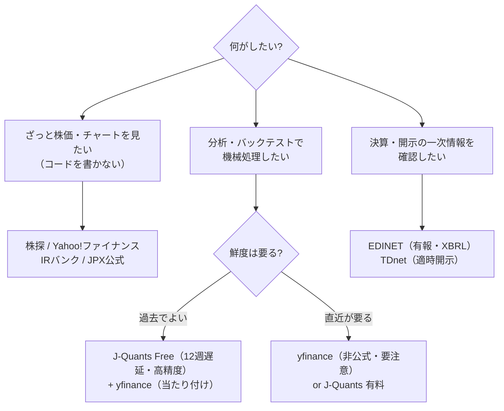

# 無料で日本株データを見る・取る実践ガイド

日本株のデータを**無料で**入手する手順を、目的別に具体的なリンク・コマンドで示す実践ガイド。
「ブラウザで目視するだけ」から「CLI で機械処理する」まで、用途に応じた選び方をまとめる。

> **前提（最初に明記）**: 本ガイドはデータの**入手手順**を扱う。数値の解釈・分析の枠組みは
> [`../knowledge/data-sources/data-apis-and-tools.md`](../knowledge/data-sources/data-apis-and-tools.md)、
> レポート生成の使い方は [`../README.md`](../README.md) を参照。出力は投資助言ではなく分析支援である。

## 目的から選ぶ（早見表）



| あなたの用途 | 使うもの | 料金 | 本ガイドの節 |
|---|---|---|---|
| ブラウザで株価・チャート・業績をざっと見る | 株探・Yahoo!ファイナンス・IRバンク・JPX公式 | 無料 | [1](#1-ブラウザで見るコードを書かない) |
| CLI で分析・バックテスト（このリポジトリ） | yfinance（既定）/ J-Quants | 無料 | [2](#2-cli-で機械処理するこのリポジトリ) |
| 決算・法定開示の一次情報 | EDINET API・TDnet | 無料 | [3](#3-決算開示の一次情報) |
| 「今この瞬間」の正確な株価で発注判断 | 証券会社の口座画面・板 | 無料（口座付帯・閲覧のみ） | [4](#4-無料の限界を知る) |

## 1. ブラウザで見る（コードを書かない）

インストールも登録も不要。まず相場を目で確認したいとき。

| サイト | 何に強いか | URL |
|---|---|---|
| **株探（かぶたん）** | 決算速報の速さ、「決算売買」情報 | kabutan.jp |
| **Yahoo!ファイナンス** | 株価・チャート・掲示板の総合。数十分遅延 | finance.yahoo.co.jp |
| **IRバンク** | 長期の業績・配当・自社株買い履歴（EDINET を整理） | irbank.net |
| **バフェットコード** | 財務指標の横断スクリーニング（無料枠あり） | buffett-code.com |
| **JPX公式サイト** | 投資部門別売買動向・空売り集計・裁定残など需給データ | jpx.co.jp |
| **TDnet** | 適時開示（決算短信・業績修正）の即時公表 | 「適時開示情報閲覧サービス」で検索 |

> 数値の精度・速報性は上記が実用十分だが、いずれも**閲覧専用**（規約上、自動収集・再配信は想定されていない）。機械処理は次節へ。

## 2. CLI で機械処理する（このリポジトリ）

分析 CLI（`analyze_stock.py` 等）は価格データを自動取得してレポート化する。データソースは2つ。

### 既定・主軸: yfinance（すぐ使える／直近の株価はこれ）

追加設定なしで動く。**直近の株価で分析する通常用途はこれが主軸**（near-real-time）。非公式 API のため日本株では分割・配当調整の不備が起こりうる点に注意（重要な判断の前は他ソースと突き合わせる）。

```bash
python3 analysis/analyze_stock.py 7203        # そのまま yfinance で取得
```

### opt-in: J-Quants（JPX 公式・全上場銘柄・**バックテスト向き**）

JPX（東証の親会社）の正規ルートで分割・併合調整済み・精度が高く、liquid30 を超える全上場銘柄が使える。ただし**無料プランは12週間遅延**のため、**直近の相場分析・当日ブリーフには使えない**。切り替えるのは過去データでの学習・バックテストや全銘柄スクリーニングのときに限る（通常は既定の yfinance のままでよい）。

**セットアップ（無料）:**

1. https://jpx-jquants.com/ で無料プラン登録し、ダッシュボードで **API キー**を発行（**無期限**。2025年12月の V2 移行でリフレッシュトークン方式は廃止された。2026年時点）。
2. `.env` に記入して読み込む:
   ```bash
   cp .env.example .env        # JQUANTS_API_KEY=... を記入
   set -a && source .env && set +a
   ```
3. 価格ソースを J-Quants に切り替える（どちらか）:
   ```bash
   # ① コマンドごとに指定
   python3 analysis/analyze_stock.py 7203 --source jquants

   # ② セッション全体の既定にする（価格系列を扱う全 CLI に一括で効く）
   export STOCK_HACKER_SOURCE=jquants
   python3 analysis/screen.py --rsi-below 30
   ```

**挙動と制約:**

- 優先順位は **`--source` 引数 > `STOCK_HACKER_SOURCE` > 既定 `yfinance`**。
- 対応 CLI: `analyze_stock` / `compare` / `screen` / `run_backtest` / `daily_brief` / `portfolio_review` / `income_report` / `tax_report` / `performance_report` / `adr_parity` / `research_journal`。
- `^N225` などの**指数・`USDJPY=X` などの為替は J-Quants 非対応のため自動で yfinance にフォールバック**する（ベンチマークβ・為替換算はそのまま動く）。
- **日足のみ**対応。PER/PBR などの基本情報（`fetch_info`）は引き続き yfinance を使う（切り替わるのは OHLCV 系列のみ）。
- **12週間遅延**のため、`daily_brief`（当日の市況）用途には向かない。直近が要るなら yfinance か J-Quants 有料プラン。

### 全銘柄ユニバースの構築

`build_universe.py` は J-Quants の上場銘柄一覧から `screen.py` 互換のユニバース CSV を生成する（要 `JQUANTS_API_KEY`）。

```bash
python3 analysis/build_universe.py --market プライム > analysis/universe/prime.csv
python3 analysis/screen.py --universe analysis/universe/prime.csv --rsi-below 30 --source jquants
```

### オフライン（ネットワーク不通時）

どの価格 CLI も `--synthetic` で合成データ（シード固定）により全機能が動く。ただし**実データではない**旨がレポートに自動明記される（手法デモ・検証専用）。

```bash
python3 analysis/analyze_stock.py 7203 --synthetic
```

## 3. 決算・開示の一次情報

株価と別に、業績・開示の**一次ソース**で裏を取るための無料 API。

| ソース | 内容 | 取得 |
|---|---|---|
| **EDINET API**（金融庁） | 有価証券報告書・半期報告書（XBRL） | 環境変数 `EDINET_API_KEY`（利用登録で無料発行）。本リポジトリに接続実装済み（`stocklib/edinet.py`） |
| **TDnet**（東証） | 適時開示（決算短信・業績修正）。株価を最も動かす一次情報 | Web 閲覧（公式 API なし） |

```bash
export EDINET_API_KEY=...      # 未設定でも業績分析は yfinance の財務データで動く
python3 analysis/fundamentals_report.py 7203 --years 5
```

## 4. 無料の限界を知る

無料で「今この瞬間の正確な株価を、機械処理できる形で」得る手段は日本株では事実上存在しない。鮮度・機械処理可否・無料の3つは同時に満たせず（トリレンマ）、無料枠は**「過去を正確に機械処理する」用途に最適化**されている。「今」を正確に機械処理したいなら有料 API か、証券会社の口座画面（無料だが閲覧のみ・再配信不可）になる。

- 遅延の階層、無料リアルタイム API が存在しない理由、実務的な線引きの詳細 →
  [`../knowledge/data-sources/data-apis-and-tools.md`](../knowledge/data-sources/data-apis-and-tools.md) の
  「無料でリアルタイムに近い株価を得ることの限界」節。
- **やってはいけない**: 無料の遅延データで作った集計を「今日の市況」として最新であるかのように見せること。
  自動実行の設計原則は [`automation.md`](automation.md) を参照。

## 関連ドキュメント

- [`../README.md`](../README.md) — 分析環境の全体像とコマンド早見表（「データソースと制約」節に無料入手先の早見表）。
- [`../knowledge/data-sources/data-apis-and-tools.md`](../knowledge/data-sources/data-apis-and-tools.md) — データソースの詳細・取得実務・調整後株価の落とし穴。
- [`getting-started.md`](getting-started.md) — ゼロから始める資産形成の通し順路（Step 6 でデータの限界を扱う）。
- [`automation.md`](automation.md) — デイリーブリーフの自動実行と「合成データで市況を偽装しない」原則。
